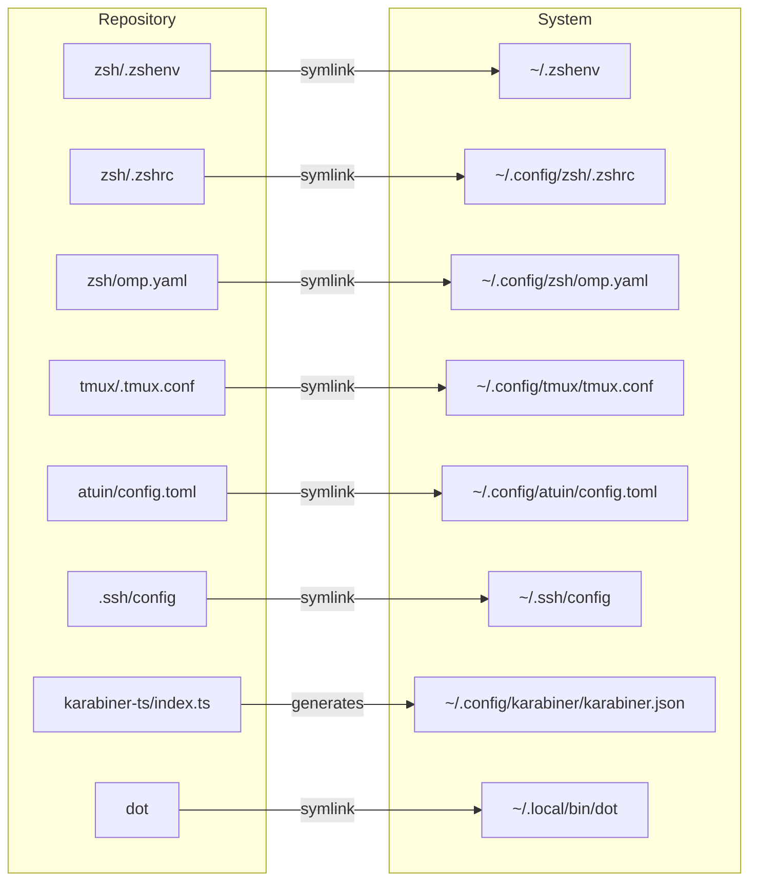
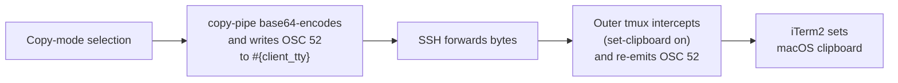

# Dotfiles

Configuration files and a management script for a personalized development environment.

## Usage

### Clone

Clone the repository to any path you like. I keep mine at `${HOME}/.config/dotfiles`.

The repository is mirrored on both GitHub and a self-hosted GitLab instance:

#### GitHub (primary)

```bash
git clone https://github.com/kaygdotorg/dotfiles.git "${HOME}/.config/dotfiles"
```

#### Self-hosted GitLab (mirror)

```bash
git clone https://git.kayg.org/kayg/dotfiles.git "${HOME}/.config/dotfiles"
```

Both remotes are kept in sync. Use whichever is more convenient or accessible.

### Setup

The `dot` script handles all linking and installation. Start by symlinking it into your PATH:

```bash
"${HOME}/.config/dotfiles/dot" setup dot
```

Then set up whichever apps you need:

```bash
dot setup zsh
dot setup tmux
dot setup atuin
dot setup ssh
dot setup karabiner  # macOS only, requires npx
```

Each `dot setup <app>` command creates the necessary directories, symlinks configuration files from this repository into the correct system paths, and installs any dependencies (plugins, binaries, etc.). Running setup again is safe — it will either skip what already exists or overwrite symlinks.

## Apps

- **Zsh** — Standalone configuration with [Oh My Posh](https://ohmyposh.dev) prompt, vi-mode, lazy-loaded nvm, and plugins (autosuggestions, syntax highlighting, history substring search, completions).
- **Tmux** — Standalone configuration with Catppuccin Mocha theme, OSC 52 clipboard support for nested sessions, vi-mode copy bindings, mouse support, and [TPM](https://github.com/tmux-plugins/tpm) for plugin management.
- **Atuin** — Shell history replacement with sync to a self-hosted server, replacing the default zsh history search.
- **SSH** — Managed SSH client configuration.
- **Karabiner** — Advanced keyboard customization via [karabiner.ts](https://github.com/evan-liu/karabiner.ts) with Colemak-DH layout and hyper key layers.

## Repository Structure

Configuration files are stored flat under each app's directory. The `dot` script is responsible for creating directories at the destination and symlinking files into place. No file in this repository needs to match its final system path.

```
.
├── dot                      # Setup and management script (POSIX sh)
├── zsh/
│   ├── .zshenv              # Sets ZDOTDIR so zsh finds its config
│   ├── .zshrc               # Main shell configuration
│   └── omp.yaml             # Oh My Posh prompt theme
├── tmux/
│   └── .tmux.conf           # Tmux configuration
├── atuin/
│   └── config.toml          # Atuin shell history configuration
├── .ssh/
│   └── config               # SSH client configuration
├── karabiner-ts/
│   └── index.ts             # Generates Karabiner-Elements JSON profile
└── scripts/
    └── toggle-menu-bar-visibility.applescript
```

### Linking map

The `dot` script symlinks each file from this repository into its expected system location. The diagram below shows what goes where:



> **Note:** Karabiner is the exception — `index.ts` is executed via `npx karabiner.ts`, which writes the profile JSON directly to `~/.config/karabiner/karabiner.json`. It is not symlinked.

## Quirks

### Nested tmux clipboard (inner SSH → outer Mac → iTerm2)

Tmux's `set-clipboard on` correctly intercepts and re-emits OSC 52 escape sequences from applications (e.g., a `printf` in the shell or vim yanking), but it does **not** emit OSC 52 from its own copy mode when running nested inside another tmux (`TERM=tmux-256color`). This means yanking or mouse-selecting in copy mode silently fails to reach the outer clipboard.

The workaround: all copy-mode bindings use `copy-pipe-and-cancel` with an explicit command that base64-encodes the selection and writes an OSC 52 sequence directly to `#{client_tty}` (the terminal the tmux client is attached to). The full clipboard chain looks like this:



See the clipboard and copy-mode sections in `tmux/.tmux.conf` for the full implementation and explanation.

### Shift+Enter in Claude Code inside tmux

Shift+Enter for newlines does not work inside tmux. Tmux only forwards extended key sequences (kitty keyboard protocol) to applications that explicitly request them, and Claude Code does not opt in.

The `extended-keys always` setting would fix this, but it causes breakage elsewhere:

- Shift+Tab sends raw escape codes instead of working properly ([tmux#4304](https://github.com/tmux/tmux/issues/4304))
- Pasting in Neovim produces artifacts ([gpakosz/.tmux#776](https://github.com/gpakosz/.tmux/issues/776))
- Fish shell completions break in tmux 3.5+ ([tmux#2705](https://github.com/tmux/tmux/issues/2705))

**Use `\` + Enter for newlines in Claude Code instead.** This is documented in the terminal section of `tmux/.tmux.conf`.

## License

See [LICENSE](LICENSE) file for details.
