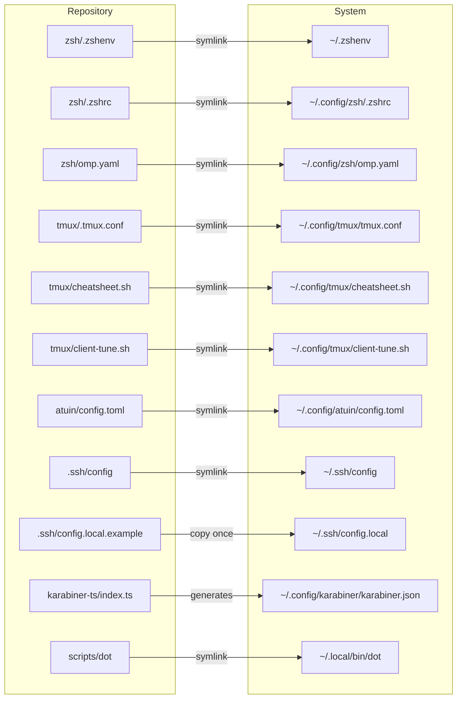
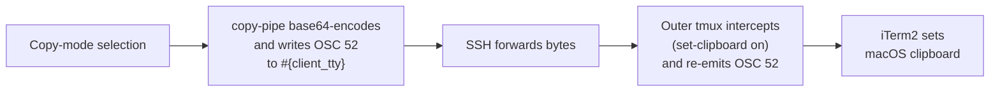

# Dotfiles

Configuration files and a management script for a personalized development environment.

## Usage

### Clone

Clone the repository to any path you like — the `dot` script resolves its own location, so nothing depends on where it lives. The examples below use `${HOME}/Developer/dotfiles`.

The repository is mirrored on both GitHub and a self-hosted GitLab instance:

#### GitHub (primary)

```bash
git clone https://github.com/kaygdotorg/dotfiles.git "${HOME}/Developer/dotfiles"
```

#### Self-hosted GitLab (mirror)

```bash
git clone https://git.kayg.org/kayg/dotfiles.git "${HOME}/Developer/dotfiles"
```

Both remotes are kept in sync. Use whichever is more convenient or accessible.

### Setup

The `dot` script handles all linking and installation. Start by symlinking it into your PATH:

```bash
"${HOME}/Developer/dotfiles/scripts/dot" setup dot
```

Then set up whichever apps you need:

```bash
dot setup zsh
dot setup tmux
dot setup atuin
dot setup ssh
dot setup karabiner  # macOS only, requires npx
```

Each `dot setup <app>` command creates the necessary directories, symlinks configuration files from this repository into the correct system paths, and installs any dependencies (plugins, binaries, etc.). Running setup again is safe: existing symlinks are overwritten, existing zsh plugins are skipped, and existing Atuin installs are reused.

**Pre-existing files are never destroyed.** If a real file (rather than one of our symlinks) already sits at a destination — a distro-provided `~/.zshenv`, an `~/.ssh/config` you wrote by hand — it is moved to `<file>.bak.<timestamp>` before the symlink is created, and the backup is announced as it happens.

**When something fails**, `dot` prints the failing command and its output rather than a bare `failed`. Set `DOT_LOG` to also keep a transcript of every command:

```bash
DOT_LOG=/tmp/dot.log dot setup zsh
```

### Command format and validation

The `dot` CLI accepts exactly two arguments:

```bash
dot <setup|update> <dot|tmux|zsh|atuin|ssh|karabiner>
```

If arguments are missing or invalid, `dot` prints usage and exits with a non-zero status.

### Re-running setup commands

- `dot setup zsh` reuses the existing install directory and skips plugin repos that are already present.
- `dot setup atuin` reuses an existing `~/.atuin/bin/atuin` installation, ensures `~/.local/bin` exists, and then refreshes the symlink/config.
- `dot setup dot`, `dot setup tmux`, and `dot setup ssh` are symlink-based and can be run repeatedly.
- `dot setup ssh` seeds `~/.ssh/config.local` from `.ssh/config.local.example` the first time only — your machine-local hosts are never overwritten.
- `dot setup karabiner` refuses to run anywhere but macOS.

## Apps

- **Zsh** — Standalone configuration with [Oh My Posh](https://ohmyposh.dev) prompt, vi-mode, lazy-loaded nvm, and plugins (autosuggestions, syntax highlighting, history substring search, completions).
- **Tmux** — Standalone configuration with Catppuccin Mocha theme, OSC 52 clipboard support for nested sessions, vi-mode copy bindings, mouse support, `F12`/`M-F` pass-through toggle for nested sessions, searchable keybindings cheatsheet (`prefix + ?`), per-client tuning on attach, and [TPM](https://github.com/tmux-plugins/tpm) for plugin management.
- **Atuin** — Shell history replacement with sync to a self-hosted server, replacing the default zsh history search.
- **SSH** — Managed SSH client configuration, tuned for mobile links (keepalives, connection multiplexing), with machine-local hosts kept out of the repository in `~/.ssh/config.local`.
- **Karabiner** — Advanced keyboard customization via [karabiner.ts](https://github.com/evan-liu/karabiner.ts) with Colemak-DH layout and hyper key layers.

## Repository Structure

Configuration files are stored flat under each app's directory. The `dot` script is responsible for creating directories at the destination and symlinking files into place. No file in this repository needs to match its final system path.

```
.
├── .github/workflows/
│   └── shellcheck.yml       # Lints the sh scripts; checks dot's dispatch table
├── scripts/
│   ├── dot                  # Setup and management script (POSIX sh)
│   └── toggle-menu-bar-visibility.applescript
├── zsh/
│   ├── .zshenv              # Sets ZDOTDIR so zsh finds its config
│   ├── .zshrc               # Main shell configuration
│   └── omp.yaml             # Oh My Posh prompt theme
├── tmux/
│   ├── .tmux.conf           # Tmux configuration
│   ├── cheatsheet.sh        # prefix + ? keybindings popup
│   └── client-tune.sh       # Per-client tuning, run on every attach
├── atuin/
│   └── config.toml          # Atuin shell history configuration
├── .ssh/
│   ├── config               # SSH client configuration
│   └── config.local.example # Template for machine-local hosts (untracked)
└── karabiner-ts/
    └── index.ts             # Generates Karabiner-Elements JSON profile
```

### Linking map

The `dot` script symlinks each file from this repository into its expected system location. The diagram below shows what goes where:


```mermaid
graph LR
    subgraph Repository
        A["zsh/.zshenv"]
        B["zsh/.zshrc"]
        C["zsh/omp.yaml"]
        D["tmux/.tmux.conf"]
        D2["tmux/cheatsheet.sh"]
        D3["tmux/client-tune.sh"]
        E["atuin/config.toml"]
        F[".ssh/config"]
        F2[".ssh/config.local.example"]
        G["karabiner-ts/index.ts"]
        H["scripts/dot"]
    end

    subgraph System
        A1["~/.zshenv"]
        B1["~/.config/zsh/.zshrc"]
        C1["~/.config/zsh/omp.yaml"]
        D1["~/.config/tmux/tmux.conf"]
        D21["~/.config/tmux/cheatsheet.sh"]
        D31["~/.config/tmux/client-tune.sh"]
        E1["~/.config/atuin/config.toml"]
        F1["~/.ssh/config"]
        F21["~/.ssh/config.local"]
        G1["~/.config/karabiner/karabiner.json"]
        H1["~/.local/bin/dot"]
    end

    A -->|symlink| A1
    B -->|symlink| B1
    C -->|symlink| C1
    D -->|symlink| D1
    D2 -->|symlink| D21
    D3 -->|symlink| D31
    E -->|symlink| E1
    F -->|symlink| F1
    F2 -->|copy once| F21
    G -->|generates| G1
    H -->|symlink| H1
```

> **Note:** Karabiner is the exception — `index.ts` is executed via `npx karabiner.ts`, which writes the profile JSON directly to `~/.config/karabiner/karabiner.json`. It is not symlinked.

## Quirks

### Nested tmux clipboard (inner SSH → outer Mac → iTerm2)

Tmux's `set-clipboard on` correctly intercepts and re-emits OSC 52 escape sequences from applications (e.g., a `printf` in the shell or vim yanking), but it does **not** emit OSC 52 from its own copy mode when running nested inside another tmux (`TERM=tmux-256color`). This means yanking or mouse-selecting in copy mode silently fails to reach the outer clipboard.

The workaround: all copy-mode bindings use `copy-pipe-and-cancel` with an explicit command that base64-encodes the selection and writes an OSC 52 sequence directly to `#{client_tty}` (the terminal the tmux client is attached to). The full clipboard chain looks like this:


```mermaid
graph LR
    A["Copy-mode selection"] --> B["copy-pipe base64-encodes\nand writes OSC 52\nto #{client_tty}"]
    B --> C["SSH forwards bytes"]
    C --> D["Outer tmux intercepts\n(set-clipboard on)\nand re-emits OSC 52"]
    D --> E["iTerm2 sets\nmacOS clipboard"]
```

See the clipboard and copy-mode sections in `tmux/.tmux.conf` for the full implementation and explanation.

### Nested tmux pass-through (F12 or M-F)

When running tmux inside tmux (e.g., SSH into a remote machine that also runs tmux), key bindings are captured by the outer session. Press `F12` **or `M-F`** to toggle pass-through mode — all keys go directly to the inner tmux. The outer status bar shows a red `PASS` pill while it is active, and both keys print a confirmation message. Press either key again to return to normal mode.

Two keys are bound on purpose. Apple's Magic Keyboard and Smart Keyboard Folio for iPad have **no function row**, so on an iPad `F12` is unreachable — leaving no way into pass-through and, more importantly, no way back out of it. `M-F` is Alt+Shift+F, chosen so it does not shadow readline's `M-f` (forward-word); `C-\` was avoided because it is SIGQUIT.

Both keys are bound in the `root` **and** `off` key tables, because pass-through disables the prefix — the key that turns it back off cannot be a prefix binding.

### Per-client tuning on attach

Status bar position, refresh interval and the padding row are decided per client by `tmux/client-tune.sh`, wired to tmux's `client-attached` and `client-session-changed` hooks. The second hook matters because the tuning is stored in *session* options: without it, a session created later (`prefix + C-c`) or switched to would keep the global defaults.

The hooks pass `#{client_height}` and `#{client_session}` to the script as arguments. Asking tmux from inside the script instead — an untargeted `display-message -p` — is racy: during a session change it was observed reporting the session being switched *away* from, which tuned the wrong session.

This used to be three `if-shell` blocks in `tmux.conf`, which were quietly wrong. **`if-shell` evaluates against the tmux _server's_ environment, which is frozen when the server first starts.** Since `.zshrc` auto-starts tmux, the server is nearly always started by a local client — so every later attach from an iPad or over SSH was still judged "local", and `prefix + r` could not change the verdict either.

The hook re-runs on every attach and reads the attaching client's own `SSH_CONNECTION`, which tmux copies into the session environment via `update-environment` (and marks as removed on a local attach). Note that `escape-time` cannot participate: it is a server option and can never vary per client, so it is set once to the mobile-safe 50ms.

### Keybindings cheatsheet (prefix + ?)

Press `prefix + ?` to open a searchable, scrollable popup listing every key binding with human-readable descriptions. It covers all three key tables (prefix, root, copy mode) and includes plugin bindings. Use `/` to search, arrow keys or `j`/`k` to scroll, and `q` to close.

The implementation lives in `tmux/cheatsheet.sh` rather than inline in `tmux.conf`, where it had grown into a single escaped one-liner of embedded awk that could not be reviewed or edited without counting backslashes.

### iOS and iPadOS (rootshell)

[rootshell](https://www.rootshell.com/) is the terminal used on iPhone and iPad. Three settings in `tmux.conf` are there because rootshell asks for them specifically:

```tmux
set -g mouse on
set -g set-titles on
set -g set-titles-string '#T'
```

The bare `#T` matters: rootshell names tabs from what the pane reports, so a decorated title string gives it a decorated tab name.

Other things worth knowing on a phone or tablet:

- **Pass-through needs `M-F`**, not `F12` — see above.
- **Truecolor**: rootshell is [libghostty](https://ghostty.org)-based and reports `xterm-ghostty`. The config now flags `RGB` for every terminal (`terminal-features ",*:RGB"`); previously only an exact `xterm-256color` got truecolor, so the Catppuccin hexes were being quantized. If a server has no terminfo entry for `xterm-ghostty`, either install it there or set `SetEnv TERM=xterm-256color` for that host in `~/.ssh/config.local`.
- **Two devices, one session**: `window-size latest` and `aggressive-resize on` stop a phone attaching from reflowing the panes on the desktop. `prefix + D` detaches every other client.
- **A private view per device**: set `TMUX_CLIENT_NAME` in the terminal app's per-connection environment and `.zshrc` will attach a *grouped* session — the same windows as `work`, but with its own current window and its own size. Without it, behaviour is unchanged.
- **The padding row is dropped on short clients** (under 30 rows), where it costs a tenth of the screen.
- **Touch selection vs. mouse mode**: with `mouse on`, drag gestures go to tmux. `prefix + m` toggles mouse mode off if you would rather select text with a finger.

### Skipping the tmux autostart

`.zshrc` execs into tmux for interactive shells. It stays out of the way when it should: transfers (scp/rsync/sftp) are not interactive, and a forced command — VS Code Remote, `ssh host cmd`, editor and agent remotes — is skipped via `SSH_ORIGINAL_COMMAND`. To opt out by hand for one connection:

```bash
DOT_NO_AUTOTMUX=1 ssh somehost
```

### Paste buffer reference view

Tmux stores every yanked selection in a paste buffer stack. Two bindings make it easy to reference previous yanks while working:

- **`Y` in copy mode** — Yanks the selection to both the paste buffer and the system clipboard (via OSC 52), then immediately opens it in a resizable split pane for reference.
- **`prefix + b`** — Browse all paste buffers, select one, and open it in a split pane. Use `prefix + =` to browse and paste instead.

The reference split is scrollable and searchable (powered by `less`), resizable with `prefix + H/J/K/L` or mouse drag, and closes with `q`.

### Shift+Enter in Claude Code inside tmux

Shift+Enter for newlines does not work inside tmux. Tmux only forwards extended key sequences (kitty keyboard protocol) to applications that explicitly request them, and Claude Code does not opt in.

The `extended-keys always` setting would fix this, but it causes breakage elsewhere:

- Shift+Tab sends raw escape codes instead of working properly ([tmux#4304](https://github.com/tmux/tmux/issues/4304))
- Pasting in Neovim produces artifacts ([gpakosz/.tmux#776](https://github.com/gpakosz/.tmux/issues/776))
- Fish shell completions break in tmux 3.5+ ([tmux#2705](https://github.com/tmux/tmux/issues/2705))

**Use `\` + Enter for newlines in Claude Code instead.** This is documented in the terminal section of `tmux/.tmux.conf`.

## License

See [LICENSE](LICENSE) file for details.
