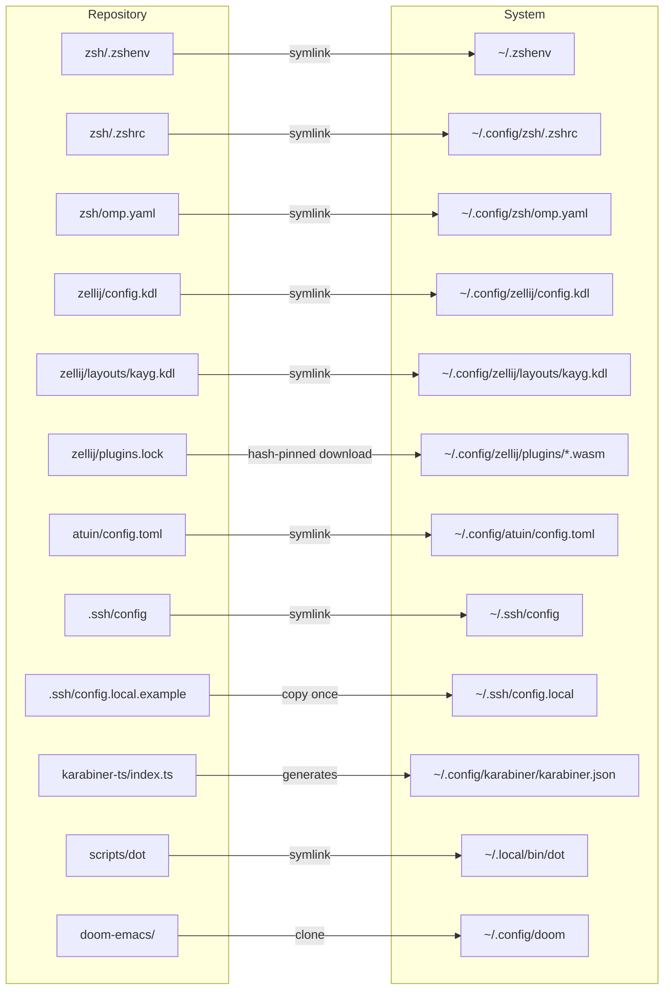

# Dotfiles

Configuration files and a management script for a personalized development environment.

## Usage

### Clone

Clone the repository to any path you like — the `dot` script resolves its own location, so nothing depends on where it lives. The examples below use `${HOME}/Developer/dotfiles`.

The repository is mirrored on both GitHub and a self-hosted GitLab instance:

#### GitHub (primary)

```bash
git clone https://github.com/kaygdotorg/dotfiles.git "${HOME}/Developer/dotfiles"
```

#### Self-hosted GitLab (mirror)

```bash
git clone https://git.kayg.org/kayg/dotfiles.git "${HOME}/Developer/dotfiles"
```

Both remotes are kept in sync. Use whichever is more convenient or accessible.

### Setup

The `dot` script handles all linking and installation. Start by symlinking it into your PATH:

```bash
"${HOME}/Developer/dotfiles/scripts/dot" setup dot
```

Then set up whichever apps you need:

```bash
dot setup nix          # installs the Nix package manager + wires Home Manager
dot setup zsh
dot setup zellij
dot setup doom
dot setup atuin
dot setup ssh
dot setup karabiner    # macOS only, requires npm
```

Each `dot setup <app>` command creates the necessary directories, symlinks configuration files from this repository into the correct system paths, and fetches only the hash-pinned plugin artifacts named in a lockfile. Running setup again is safe: existing symlinks are overwritten, existing zsh plugins are skipped, and hash-verified plugins are reused.

**Division of responsibility:** `dot` manages *dotfiles only*. User packages (zellij, zsh plugins' binaries, oh-my-posh, atuin, emacs, and friends) are owned by Home Manager/Nix. The one exception is `dot setup nix`, which installs the Nix package manager itself — after that initial run, no further sudo is needed.

**Pre-existing files are never destroyed.** If a real file (rather than one of our symlinks) already sits at a destination — a distro-provided `~/.zshenv`, an `~/.ssh/config` you wrote by hand — it is moved to `<file>.bak.<timestamp>` before the symlink is created, and the backup is announced as it happens.

**When something fails**, `dot` prints the failing command and its output rather than a bare `failed`. Set `DOT_LOG` to also keep a transcript of every command:

```bash
DOT_LOG=/tmp/dot.log dot setup zsh
```

### Command format and validation

The `dot` CLI accepts exactly two arguments:

```bash
dot <setup|update> <dot|zsh|zellij|doom|atuin|ssh|karabiner|nix>
```

If arguments are missing or invalid, `dot` prints usage and exits with a non-zero status.

### Re-running setup commands

- `dot setup zsh` reuses the existing install directory and skips plugin repos that are already present.
- `dot setup zellij` links the tracked `config.kdl` and `kayg.kdl`, then downloads only the exact hash-pinned Zellij plugins listed in `zellij/plugins.lock`. A checksum mismatch aborts rather than installing unverified bytes.
- `dot update zellij` never fetches a moving "latest" release. To upgrade a plugin, update its entry in `zellij/plugins.lock` (version, URL, sha256) after review, then rerun setup on each machine.
- `dot setup doom` clones this repo's Doom config into `~/.config/doom` (Doom's standard location) and requires Emacs to already be installed. Use `doom doctor` to verify the environment and `dot update doom` to pull plus `doom sync`.
- `dot setup atuin` links an existing Atuin install into `~/.local/bin` and refreshes its config; the binary itself comes from Home Manager/Nix.
- `dot setup dot`, `dot setup ssh`, and `dot setup karabiner` are symlink/generation-based and can be run repeatedly.
- `dot setup ssh` seeds `~/.ssh/config.local` from `.ssh/config.local.example` the first time only — your machine-local hosts are never overwritten.
- `dot setup karabiner` refuses to run anywhere but macOS.
- `dot setup nix` is idempotent: it installs Determinate Nix if missing, re-pins `nixpkgs` to unstable HEAD, wires the platform auto-update (Linux systemd user timer, macOS LaunchAgent), and verifies the daemon, pin, and Home Manager flake end to end.

## Apps

- **Zsh** — Standalone configuration with [Oh My Posh](https://ohmyposh.dev) prompt, vi-mode, lazy-loaded nvm, OSC 133 semantic-prompt marks for Zellij, and plugins (autosuggestions, syntax highlighting, history substring search, completions).
- **Zellij** — Catppuccin Mocha theme, a custom bottom `zjstatus` pill bar (`kayg` layout), a background compact-bar that renders contextual mode tooltips without a persistent status row, mouse ergonomics, OSC 52 clipboard, and bounded scrollback resurrection. WASM plugins (`zjstatus`, `zellij-tabula`) are pinned by hash in `zellij/plugins.lock`.
- **Doom Emacs** — Doom configuration cloned into `~/.config/doom`; Emacs itself is a Home Manager package.
- **Atuin** — Shell history replacement with sync to a self-hosted server, replacing the default zsh history search.
- **SSH** — Managed SSH client configuration, tuned for mobile links (keepalives, connection multiplexing), with machine-local hosts kept out of the repository in `~/.ssh/config.local`.
- **Karabiner** — Advanced keyboard customization via [karabiner.ts](https://github.com/evan-liu/karabiner.ts) with Colemak-DH layout and hyper key layers.
- **Home Manager / Nix** — User package management for every machine. The flake lives in `home-manager/` (macOS) and `dot setup nix` wires the package manager and its daily auto-update.

## Repository Structure

Configuration files are stored flat under each app's directory. The `dot` script is responsible for creating directories at the destination and symlinking files into place. No file in this repository needs to match its final system path.

```
.
├── .github/workflows/
│   └── shellcheck.yml       # Lints the sh scripts; checks dot's dispatch table
├── scripts/
│   ├── dot                  # Setup and management script (POSIX sh)
│   └── toggle-menu-bar-visibility.applescript
├── zsh/
│   ├── .zshenv              # Sets ZDOTDIR so zsh finds its config
│   ├── .zshrc               # Main shell configuration
│   └── omp.yaml             # Oh My Posh prompt theme
├── zellij/
│   ├── config.kdl           # Zellij configuration
│   ├── layouts/kayg.kdl     # Custom bottom status-bar layout
│   └── plugins.lock         # Hash-pinned Zellij plugin releases
├── doom-emacs/              # Doom Emacs configuration (cloned to ~/.config/doom)
├── atuin/
│   └── config.toml          # Atuin shell history configuration
├── .ssh/
│   ├── config               # SSH client configuration
│   └── config.local.example # Template for machine-local hosts (untracked)
├── karabiner-ts/
│   └── index.ts             # Generates Karabiner-Elements JSON profile
└── home-manager/            # Nix/Home Manager flake (user packages)
```

### Linking map

The `dot` script symlinks each file from this repository into its expected system location. The diagram below shows what goes where:


```mermaid
graph LR
    subgraph Repository
        A["zsh/.zshenv"]
        B["zsh/.zshrc"]
        C["zsh/omp.yaml"]
        D["zellij/config.kdl"]
        D2["zellij/layouts/kayg.kdl"]
        D3["zellij/plugins.lock"]
        E["atuin/config.toml"]
        F[".ssh/config"]
        F2[".ssh/config.local.example"]
        G["karabiner-ts/index.ts"]
        H["scripts/dot"]
        X["doom-emacs/"]
    end

    subgraph System
        A1["~/.zshenv"]
        B1["~/.config/zsh/.zshrc"]
        C1["~/.config/zsh/omp.yaml"]
        D1["~/.config/zellij/config.kdl"]
        D21["~/.config/zellij/layouts/kayg.kdl"]
        D31["~/.config/zellij/plugins/*.wasm"]
        E1["~/.config/atuin/config.toml"]
        F1["~/.ssh/config"]
        F21["~/.ssh/config.local"]
        G1["~/.config/karabiner/karabiner.json"]
        H1["~/.local/bin/dot"]
        X1["~/.config/doom"]
    end

    A -->|symlink| A1
    B -->|symlink| B1
    C -->|symlink| C1
    D -->|symlink| D1
    D2 -->|symlink| D21
    D3 -->|hash-pinned download| D31
    E -->|symlink| E1
    F -->|symlink| F1
    F2 -->|copy once| F21
    G -->|generates| G1
    H -->|symlink| H1
    X -->|clone| X1
```

> **Note:** Karabiner is the exception — its local npm dependencies are installed and `index.ts` is executed via `tsx`, which writes the profile JSON directly to `~/.config/karabiner/karabiner.json`. It is not symlinked.

## Quirks

### Skipping the Zellij autostart

`.zshrc` opens the Zellij session picker for interactive shells. It stays out of the way when it should: transfers (scp/rsync/sftp) are not interactive, and a forced command — VS Code Remote, `ssh host cmd`, editor and agent remotes — is skipped via `SSH_ORIGINAL_COMMAND`. To opt out by hand for one connection:

```bash
DOT_NO_AUTOMUX=1 ssh somehost
```

## License

See [LICENSE](LICENSE) file for details.